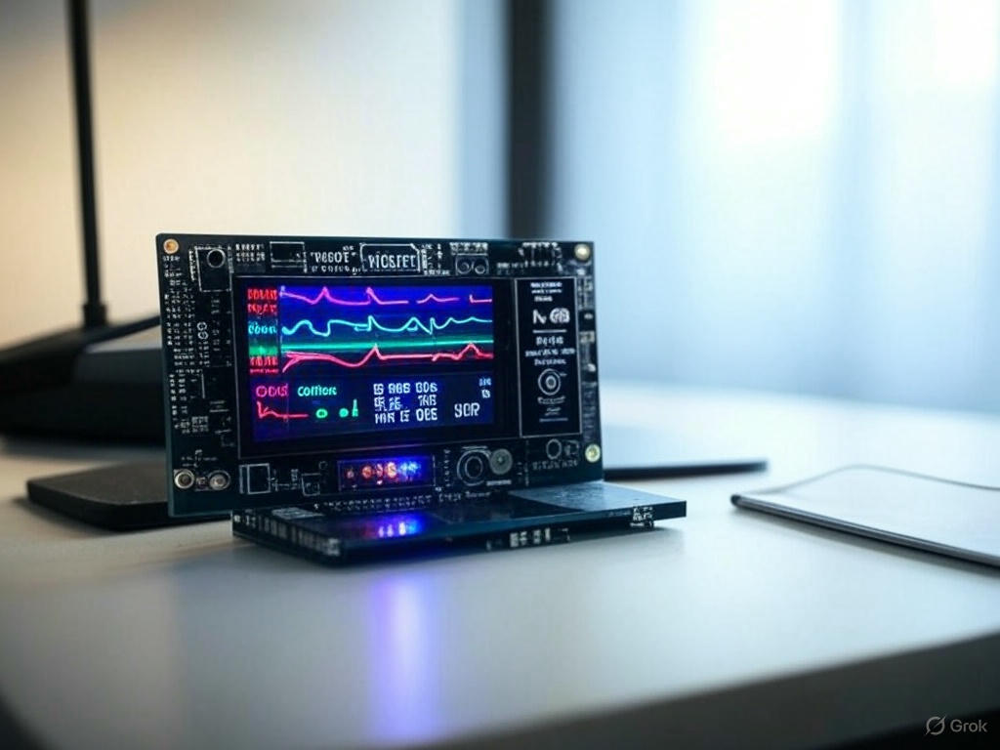

# Biotelemetry System for Remote Patient Monitoring



This project is an advanced health monitoring system built using an **ESP32 TTGO T-Call SIM800L** board. It measures heart rate (BPM) and oxygen saturation (SPO2) using a MAX30102 sensor, displays results on a 20x4 I2C LCD, provides visual and audible alerts via an RGB LED and buzzer, and integrates with Blynk for remote monitoring over WiFi. SMS alerts are sent via the SIM800L module when critical conditions are detected.

**Author:** Christian Kusi.  
**Date:** March 2025

---

## Table of Contents
- [Features](#features)
- [Hardware Components](#hardware-components)
- [Pin Connections](#pin-connections)
- [Prerequisites](#prerequisites)
- [Installation](#installation)
- [Configuration](#configuration)
- [Usage](#usage)
- [Screenshots](#screenshots)
- [Troubleshooting](#troubleshooting)
- [Contributing](#contributing)
- [License](#license)

---

## Features

- **Real-Time Monitoring:** Measures BPM and SPO2 every 15 seconds, updating the LCD and Blynk app in real-time.
- **Alerts:**
  - Visual: RGB LED (Red: critical, Blue: low BPM, Green: normal).
  - Audible: Buzzer with distinct patterns for different conditions.
- **Remote Access:** Connects to Blynk via WiFi for remote data viewing.
- **SMS Notifications:** Sends health reports to a specified phone number via SIM800L when critical thresholds are exceeded (BPM > 100, BPM < 60, SPO2 < 95).
- **User Interface:** Displays welcome screen, measurement progress, and results on a 20x4 I2C LCD.
- **Idle Prompt:** Shows a "Press button to start" message when not measuring.

---

## Hardware Components

| Component                  | Description                                  | Image Reference         |
|----------------------------|----------------------------------------------|-------------------------|
| ESP32 TTGO T-Call SIM800L  | Microcontroller with WiFi and GSM            | `ttgo_tcall.jpg`        |
| MAX30102 Sensor            | Pulse oximeter and heart rate sensor         | `max30102.jpg`          |
| 20x4 I2C LCD Display       | Displays messages and readings               | `lcd_20x4.jpg`          |
| RGB LED Module             | Visual alerts (Red, Green, Blue)             | `rgb_led.jpg`           |
| Buzzer                     | Audible alerts                               | `buzzer.jpg`            |
| Push Button                | Triggers measurement                         | `button.jpg`            |

---

## Pin Connections

| Component         | Pin on ESP32 TTGO T-Call | Notes                  |
|-------------------|--------------------------|------------------------|
| Button            | GPIO 33                  | Internal pull-up       |
| Buzzer            | GPIO 32                  | Active high            |
| Red LED           | GPIO 19                  |                        |
| Green LED         | GPIO 18                  |                        |
| Blue LED          | GPIO 13                  |                        |
| LCD (SDA)         | GPIO 21                  | I2C bus                |
| LCD (SCL)         | GPIO 22                  | I2C bus                |
| MAX30102 (SDA)    | GPIO 21                  | I2C bus                |
| MAX30102 (SCL)    | GPIO 22                  | I2C bus                |
| SIM800L RST       | GPIO 5                   |                        |
| SIM800L PWKEY     | GPIO 4                   |                        |
| SIM800L POWER_ON  | GPIO 23                  |                        |
| SIM800L TX        | GPIO 27                  |                        |
| SIM800L RX        | GPIO 26                  |                        |

See `images/wiring_diagram.png` for a visual representation.

---

## Prerequisites

- **Arduino IDE**: Version 1.8.19 or later.
- **Libraries**:
  - `MAX30105.h` (MAX30102 sensor)
  - `spo2_algorithm.h` (SPO2 calculations)
  - `LiquidCrystal_I2C.h` (I2C LCD)
  - `TinyGsmClient.h` (SIM800L GSM)
  - `BlynkSimpleEsp32.h` (Blynk WiFi)
  - Install via Arduino Library Manager.
- **ESP32 Board Support**: Add via Boards Manager (`https://dl.espressif.com/dl/package_esp32_index.json`).
- **SIM Card**: With active data and SMS plan.
- **Blynk Account**: For remote monitoring setup.

---

## Installation

1. **Clone the Repository**:
   ```bash
   git clone https://github.com/<your-username>/biotelemetry-system.git
   cd biotelemetry-system

   I understand your request! You want to prepare your ESP32 TTGO T-Call SIM800L-based biotelemetry project for uploading to GitHub, complete with a comprehensive `README.md` file, relevant images, and all necessary details to make it a well-documented repository. I’ll help you create these materials, ensuring your project is professional, clear, and ready for others to explore or contribute to. Below, I’ll provide:

1. **A polished `README.md`** file in Markdown format, tailored to your project.
2. **Suggestions for images** to include (and descriptions of what they should depict).
3. **Guidance on structuring your GitHub repository**.
4. **Any additional notes** to ensure everything is complete.

Let’s get started!


## Installation

1. **Clone the Repository**:
   ```bash
   git clone [https://github.com/ChrisKusi/Biotelemetry-System-for-Remote-Patient-Monitoring.git](https://github.com/ChrisKusi/Biotelemetry-System-for-Remote-Patient-Monitoring.git)
   cd Biotelemetry-System-for-Remote-Patient-Monitoring
   ```

2. **Install Libraries**:
   - Open Arduino IDE.
   - Go to **Sketch > Include Library > Manage Libraries**.
   - Search and install the required libraries listed above.

3. **Open the Sketch**:
   - Open `biotelemetry_system.ino` in the Arduino IDE.

4. **Select Board**:
   - Tools > Board > ESP32 Arduino > ESP32 Dev Module.
   - Configure settings: 240MHz, QIO, 80MHz, 4MB Flash, etc.

5. **Upload the Code**:
   - Connect the ESP32 TTGO T-Call to your computer via USB.
   - Click the upload button in the Arduino IDE.

---

## Configuration

1. **WiFi Credentials**:
   - Edit `ssid` and `pass` in the code:
     ```cpp
     char ssid[] = "YourWiFiSSID";
     char pass[] = "YourWiFiPassword";
     ```

2. **GSM Settings**:
   - Update `apn`, `gprsUser`, and `gprsPass` based on your SIM provider:
     ```cpp
     const char apn[] = "your_apn"; // e.g., "internet" or "airtelgprs.com"
     const char gprsUser[] = "";
     const char gprsPass[] = "";
     ```

3. **Phone Number**:
   - Set the recipient phone number for SMS alerts:
     ```cpp
     const char* phoneNumber = "+1234567890";
     ```

4. **Blynk Setup**:
   - Install the Blynk app (iOS/Android).
   - Create a new project with template ID `TMPL2IrUTLMPL` and name `PulseOximeter`.
   - Copy the auth token and update:
     ```cpp
     char auth[] = "YourAuthToken";
     ```
   - Add two gauges in the app:
     - V1: Heart Rate (BPM)
     - V2: SPO2 (%)

---

## Usage

1. **Power On**:
   - Connect the ESP32 TTGO T-Call to a power source (e.g., USB or battery).
   - The LCD displays a welcome message for 5 seconds.

2. **Start Measurement**:
   - Press the button on GPIO 33 to begin a 15-second measurement.
   - Real-time BPM and SPO2 appear on the LCD and Blynk app.

3. **View Results**:
   - After 15 seconds, final readings are shown on the LCD.
   - Alerts trigger based on thresholds:
     - Red LED + 3 buzzes: Critical (BPM > 100 or SPO2 < 95).
     - Blue LED + 2 buzzes: Low BPM (< 60).
     - Green LED + 1 buzz: Normal.

4. **Receive SMS**:
   - If critical conditions are detected, an SMS is sent to the configured phone number.

5. **Idle State**:
   - When idle, the LCD prompts "Press button to start measurement".

---

## Screenshots

| Description                | Image File             |
|----------------------------|------------------------|
| Welcome Screen             | `welcome_screen.jpg`   |
| Measuring in Progress      | `measuring.jpg`        |
| Final Results              | `results.jpg`          |
| SMS Sent Confirmation      | `sms_sent.jpg`         |
| Blynk App Dashboard        | `blynk_dashboard.jpg`  |

---

## Troubleshooting

- **No WiFi Connection**:
  - Verify `ssid` and `pass` are correct.
  - Check WiFi signal strength.
- **SMS Not Sending**:
  - Ensure SIM card has SMS credit and is inserted correctly.
  - Confirm `phoneNumber` is in international format (e.g., `+233...`).
- **Invalid Readings (0)**:
  - Ensure finger is placed correctly on the MAX30102 sensor.
- **LCD Not Displaying**:
  - Check I2C address (default: 0x27) and wiring (SDA: 21, SCL: 22).
- **Serial Monitor**:
  - Open at 115200 baud for debug output.

---

## Contributing

Contributions are welcome! Please:
1. Fork the repository.
2. Create a feature branch (`git checkout -b feature/YourFeature`).
3. Commit changes (`git commit -m "Add YourFeature"`).
4. Push to the branch (`git push origin feature/YourFeature`).
5. Open a Pull Request.

---

## License

This project is licensed under the MIT License. See `LICENSE` for details.

---


